[](https://github.com/saedyousef/StandWithPalestine)
[](https://techforpalestine.org/learn-more)
[](https://wakatime.com/@03bf07e2-4c78-4826-8603-8922f0241061)
<!-- [](https://user-badge.committers.top/jordan_private/saedyousef) -->

<!--  -->


<!--  --> 

<!--START_SECTION:waka-->

```txt
CloudFormation   6 hrs 50 mins   ████████████▓░░░░░░░░░░░░   51.08 %
PHP              4 hrs 59 mins   █████████▒░░░░░░░░░░░░░░░   37.25 %
NodeJS           38 mins         █▒░░░░░░░░░░░░░░░░░░░░░░░   04.79 %
Markdown         23 mins         ▓░░░░░░░░░░░░░░░░░░░░░░░░   02.87 %
GitHub Actions   12 mins         ▒░░░░░░░░░░░░░░░░░░░░░░░░   01.56 %
```

<!--END_SECTION:waka-->
    
<!--  -->



