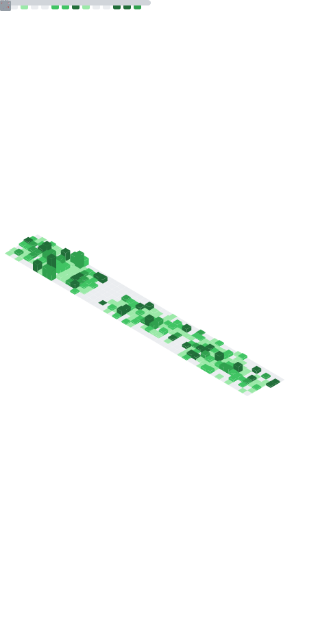

[](https://github.com/saedyousef/StandWithPalestine)
[](https://techforpalestine.org/learn-more)
[](https://wakatime.com/@03bf07e2-4c78-4826-8603-8922f0241061)
<!-- [](https://user-badge.committers.top/jordan_private/saedyousef) -->

<!--  -->


<!--  --> 

<!--START_SECTION:waka-->

```txt
PHP              3 hrs 2 mins          ███████████████████▓░░░░░   78.48 %
Blade Template   28 mins               ███░░░░░░░░░░░░░░░░░░░░░░   12.43 %
NodeJS           16 mins               █▓░░░░░░░░░░░░░░░░░░░░░░░   07.30 %
CloudFormation   3 mins                ▒░░░░░░░░░░░░░░░░░░░░░░░░   01.58 %
Markdown         0 secs                ░░░░░░░░░░░░░░░░░░░░░░░░░   00.13 %
```

<!--END_SECTION:waka-->
    
<!--  -->



