[](https://github.com/saedyousef/StandWithPalestine)
[](https://techforpalestine.org/learn-more)
[](https://wakatime.com/@03bf07e2-4c78-4826-8603-8922f0241061)
<!-- [](https://user-badge.committers.top/jordan_private/saedyousef) -->

<!--  -->


<!--  --> 

<!--START_SECTION:waka-->

```txt
PHP              2 hrs 48 mins   ████████████████████████░   96.39 %
Blade Template   4 mins          ▓░░░░░░░░░░░░░░░░░░░░░░░░   02.41 %
.env file        1 min           ▒░░░░░░░░░░░░░░░░░░░░░░░░   01.02 %
NodeJS           0 secs          ░░░░░░░░░░░░░░░░░░░░░░░░░   00.09 %
JSON             0 secs          ░░░░░░░░░░░░░░░░░░░░░░░░░   00.06 %
```

<!--END_SECTION:waka-->
    
<!--  -->



